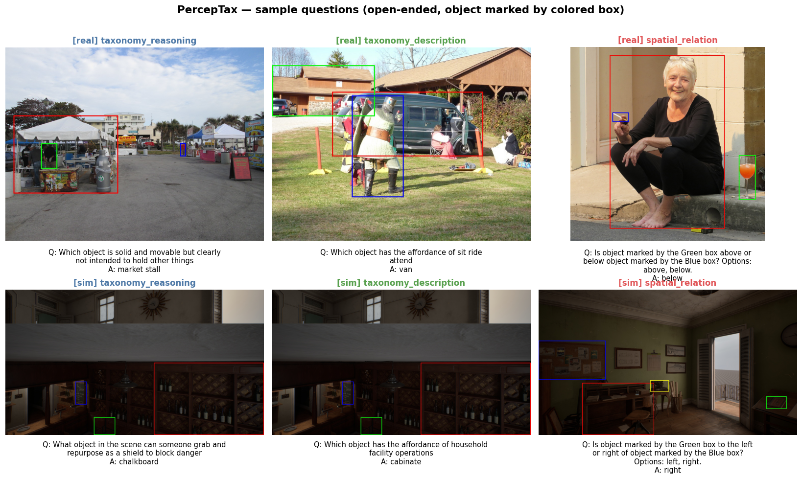

# PercepTax — Benchmarking Physical Intelligence through Cross-Property Reasoning in Vision-Language Models

**PercepTax** is an **open-ended** visual-question-answering benchmark that tests whether
vision-language models can reason *across* physical object properties — material, shape,
function, affordance — together with spatial relations and compositional / counterfactual
reasoning. In each question the object of interest is marked by a **colored box**, and the
model must answer in free form (no multiple-choice options in the prompt).



This repository holds the **data-processing & benchmark-generation pipeline** and the
**inference / evaluation** code. The benchmark data is on Hugging Face.

<p align="center">
  <a href="https://perceptual-taxonomy.github.io"></a>
  <a href="https://arxiv.org/abs/2511.19526"></a>
  <a href="https://github.com/XingruiWang/PercepTaxBench"></a>
  <a href="https://huggingface.co/datasets/RyanWW/PercepTaxBench"></a>
  <a href="https://huggingface.co/datasets/TaxonomyProject/SimulationMetadata"></a>
</p>

## Subsets

| Config | Source | Questions | Images |
|--------|--------|-----------|--------|
| `real` | Real photos (OpenImages) with 3D annotation | 5,439 | 2,516 |
| `sim`  | Rendered simulated indoor scenes | 22,644 | 14,499 |

Categories: `taxonomy_reasoning` · `taxonomy_description` · `spatial_relation`.

---

## Installation

```bash
git clone https://github.com/XingruiWang/PercepTaxBench
cd PercepTaxBench
pip install -r requirements.txt
```

---

## Inference & Evaluation

The benchmark is **open-ended**: a model receives `(image, question)` and produces a free-form
answer, scored against `answer` by **normalized exact match** plus an optional **LLM judge**
for paraphrases.

### Option A — quick standalone loop (any VLM)

```python
from datasets import load_dataset

ds = load_dataset("RyanWW/PercepTaxBench", "real", split="test")   # or "sim"

def predict(image, question):
    # plug in any VLM: HF transformers (Qwen2-VL, LLaVA, InternVL, …)
    # or an API model (GPT-4o, Gemini, Claude). Return a short string.
    ...

def norm(s): return " ".join(s.lower().split())

correct = 0
for ex in ds:
    pred = predict(ex["image"], ex["question"])
    correct += norm(pred) == norm(ex["answer"])
print("accuracy:", correct / len(ds))
```

### Option B — full harness via VLMEvalKit (recommended, multi-model + per-category report)

The `evaluation/` folder integrates PercepTax into
[VLMEvalKit](https://github.com/open-compass/VLMEvalKit):

```bash
# 1. install VLMEvalKit
git clone https://github.com/open-compass/VLMEvalKit && cd VLMEvalKit && pip install -e . && cd ..

# 2. drop in the PercepTax dataset definition
cp evaluation/taxonomy.py        VLMEvalKit/vlmeval/dataset/taxonomy.py
cp evaluation/utils_taxonomy.py  VLMEvalKit/vlmeval/dataset/utils/taxonomy.py
#    then register `TaxonomyBench` / `TaxonomyBenchSim` in vlmeval/dataset/__init__.py
#    (the open-ended TSVs are produced by pipeline/qa_gen/scripts/core/aggregate_unified_qa.py)

# 3. run a model (LLM judge needs OPENAI/GEMINI key in your env)
python evaluation/run.py --data TaxonomyBench --model Qwen2-VL-7B-Instruct --verbose
python evaluation/run.py --data TaxonomyBenchSim --model GPT4o
```

Results include overall and per-category (`taxonomy_reasoning` / `taxonomy_description` /
`spatial_relation`) accuracy.

### Visualize samples

```bash
python tools/visualize_vqa.py --n 12          # render a grid of image+Q+A panels
```

---

## Regenerating the benchmark (data pipeline)

```
Real images (OpenImages)  ─┐
                           ├─►  3D annotation  ─►  object description  ─►  QA generation  ─►  open-ended benchmark  ─►  TSV / HF dataset
Simulated scenes          ─┘
```

| Stage | Directory | Entry points |
|-------|-----------|--------------|
| 2D detection + segmentation | `pipeline/object_detection/` | `run_object_detection.py`, `hybrid_detector.py` |
| 3D ground-truth annotation | `pipeline/3d_annotation/` | `generate_3d_groundtruth_production.py` |
| Object property descriptions (Gemini) | `pipeline/object_description/` | `scripts/python/generate_image_object_descriptions.py` |
| QA generation (real / sim) | `pipeline/qa_gen/` | `scripts/core/generate_taxonomyqabench_realimage.py`, `…_simimage.py` |
| Open-ended conversion | `pipeline/qa_gen/` | `create_open_answer_benchmark.py` |
| Aggregate → TSV | `pipeline/qa_gen/` | `scripts/core/aggregate_unified_qa.py` |

Details in `docs/` (`QA_GENERATION_README.md`,
`SPATIALREASONER_DATAGEN_PIPELINE_ARCHITECTURE.md`) and `pipeline/qa_gen/*.md`.
Internal code/data keep the original `taxonomy` naming for the underlying property taxonomy.

### API keys & paths
Pipeline stages call the **Google Gemini** API. Set `GEMINI_API_KEY` in your environment
(`cp .env.example .env`); never hard-code keys. Paths use `/path/to/...` placeholders — edit
them or set `TAXONOMY_DATA_ROOT`.

### Known issues
A few inherited/WIP files have pre-existing syntax errors and are reference-only:
`pipeline/object_detection/gemini_object_detection.py`,
`pipeline/qa_gen/multiuser_app_vN.py`,
`pipeline/qa_gen/scripts/modules/qa_modules/cot_reasoning_utils.py`.

---

## License & citation

[CC-BY-4.0](https://creativecommons.org/licenses/by/4.0/), consistent with upstream
[SpatialReasonerDataGen](https://github.com/wufeim/SpatialReasonerDataGen).

```bibtex
@inproceedings{lee2026perceptax,
  title     = {PercepTax: Benchmarking Physical Intelligence through Cross-Property Reasoning in Vision-Language Models},
  author    = {Lee, Jonathan and Wang, Xingrui and Peng, Jiawei and Ye, Luoxin and Zheng, Zehan and Zhang, Tiezheng and Wang, Tao and Ma, Wufei and Chen, Siyi and Chou, Yu-Cheng and Kaushik, Prakhar and Yuille, Alan},
  booktitle = {European Conference on Computer Vision (ECCV)},
  year      = {2026}
}

@article{ma2025spatialreasoner,
  title={SpatialReasoner: Towards Explicit and Generalizable 3D Spatial Reasoning},
  author={Ma, Wufei and Chou, Yu-Cheng and Liu, Qihao and Wang, Xingrui and de Melo, Celso and Xie, Jianwen and Yuille, Alan},
  journal={arXiv preprint arXiv:2504.20024},
  year={2025}
}
```
